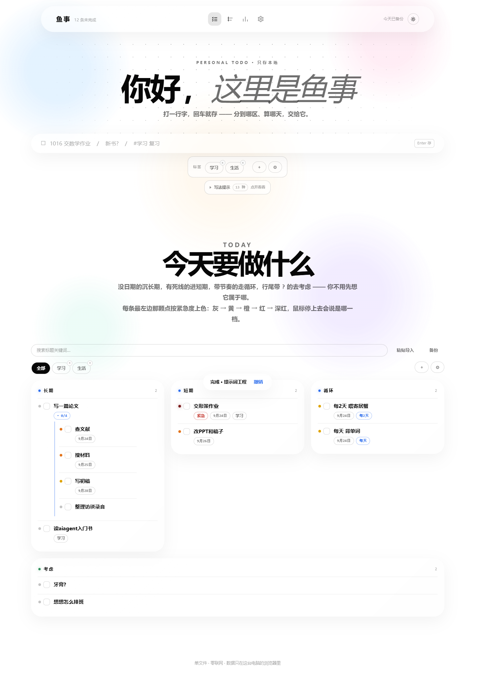

# 鱼事

一个**单文件**的个人待办应用。整个应用就是 `鱼事.html` 一个文件（约 3200 行，HTML + CSS + JS 全在里面），
没有任何构建步骤、没有依赖、没有后端，双击就能在浏览器里跑。

同时打包成两个平台：

- **安卓** —— `鱼事-v3.5.6.apk`，权限只有 `RECORD_AUDIO`（危险权限，运行时申请）+ `VIBRATE`（普通）；
  **不声明 `INTERNET`**，所以是零联网的
- **iOS** —— 一个 PWA（渐进式 Web 应用），Safari 打开后「添加到主屏幕」即成为全屏独立 App



## 功能

四个页面，顶栏图标切换：

| 页面 | 内容 |
|---|---|
| **清单** | 今天的待办，含复合目标（可嵌套子任务）、循环任务、优先级、标签、筛选、搜索 |
| **时间轴** | 按日期铺开，看逾期与堆积 |
| **统计** | 完成情况、连续记录、布局可切换 |
| **设置** | 深浅色主题、页面说明文字开关、流畅模式、标签管理、备份导出/导入 |

设计上的一些取舍：

- **数据只存在本机** —— 全部在浏览器 `localStorage` 里，不上传任何服务器，所以也不需要网络权限。
- **备份靠文件** —— 一键导出 JSON，换设备/换浏览器时导入即可。
- **动效克制** —— 折叠展开、页签滑动指示块、滚动揭示都做了，但遵循系统「减弱动态效果」设置。
- **键盘可达** —— 弹层有焦点陷阱与 `inert` 背景、页签有 `aria-current`、开关用 `role="switch"`。
- **软件渲染自动降级** —— 检测到走软件渲染（无 GPU 加速）时自动关掉昂贵的毛玻璃。

## 直接用

**安卓**：下载 `鱼事-v3.5.6.apk` 安装。装之前不用做任何事；第一次长按圆钮说话时会申请一次麦克风权限，不给也能用键盘输入。

**iOS**：用 **Safari** 打开 <https://daibanji.app.workbuddy.host/> →
分享 → 添加到主屏幕。

> 微信内置浏览器没有「添加到主屏幕」这个菜单项，需要先点右上角「…」→「在 Safari 中打开」。

**桌面**：直接双击 `鱼事.html`。

## 目录结构

```
鱼事.html                    应用本体（唯一的源文件）
鱼事-v3.5.6.apk               预编译的安卓安装包（内置离线语音模型，所以包体约 200MB）
预览-*.png                   界面截图

_android/                    安卓打包（不用 Gradle）
  build.py                   八步构建脚本
  app/
    AndroidManifest.xml      清单：零权限 + 版本号（版本号的单一真相源）
    src/com/yushi/app/
      MainActivity.java      WebView 壳
    res/                     自适应图标（5 档密度）、主题、字符串
  _tools/
    make_icons.py            程序化生成图标（水彩色块 + 透镜玻璃）
    verify_apk.py            拆开产物独立核验（包名/应用名/权限/签名/对齐/包内页面）
    preview_*.py             图标与几何的预览工具

_ios/                        iOS PWA
  build_pwa.py               生成 dist/
  dist/                      发布目录：index.html + manifest + sw.js + 图标
```

## 自己构建

### 安卓

需要 JDK 17（**不能用 21**，见下）、Android SDK 的 `build-tools;34.0.0` 与 `platforms;android-34`。

```bash
python _android/build.py
```

脚本默认读 `D:\Android\Sdk`，JDK 默认 `D:\java\java17`（可用环境变量 `DAIBANJI_JDK` 覆盖）。
构建在纯 ASCII 的 `D:\Android\build` 里进行，最后把 APK 拷回项目根目录。

**签名口令不进版本库。** 先准备好密钥与口令，二选一：

```bash
# 方式一：环境变量
set YUSHI_KS_PASS=<你的口令>

# 方式二：口令文件（已 gitignore）
copy _android\keystore\keystore.properties.example _android\keystore\keystore.properties
# 然后编辑 storePassword= 那一行
```

第一次运行时若 `_android/keystore/daibanji.jks` 不存在，脚本会自动用这个口令生成一个
27 年有效期的自建密钥。**这个文件和口令要自己留好** —— 换了它，已安装的旧版本就无法覆盖升级。

> ⚠️ **为什么口令不能写进代码**：安卓只认签名不认人。谁同时拿到 `.jks` 和口令，
> 谁就能签出包名与签名都一致的包，以「官方更新」的名义让已安装用户静默覆盖升级。
> 所以这两样都在 `.gitignore` 里。

### iOS / PWA

```bash
python _ios/build_pwa.py
```

生成 `_ios/dist/`，把整个目录部署成一个静态站点即可。版本号自动从
`_android/app/AndroidManifest.xml` 读取，两个平台共用一个来源。

## 一些实现上的坑（都写在代码注释里了）

- **`file://` 不能用来装 localStorage 数据**。安卓壳通过 `shouldInterceptRequest`
  把 `https://appassets.androidplatform.net/` 映射到 APK 内的 assets，
  请求在进网络栈之前就被拦掉，所以既不建 socket、也不需要 `INTERNET` 权限，
  同时 `localStorage` 拿到的是一个稳定正规的 https origin。
- **JDK 21 编出来的 class 会让 d8 崩**。JDK 21 会给内部类构造器的 synthetic 参数写
  `MethodParameters` 且 `name_index = 0`，d8 解析无名参数时内部 NPE，报错位置和真凶无关。
  `-g:none` 关不掉，换 `--release` 也没用，只能换 JDK。
- **揭示动画不能用 `transition`**。组件的 `transition: transform` 简写会整体覆盖掉
  父级的 `opacity`/`filter` 过渡，导致同一页面两种节奏。改用 `@keyframes` +
  `animation-fill-mode: backwards`（不能用 `both`，会把终态 transform 永久钉住）。

## 许可

未指定许可证。如需开源请补充（例如 MIT）。
